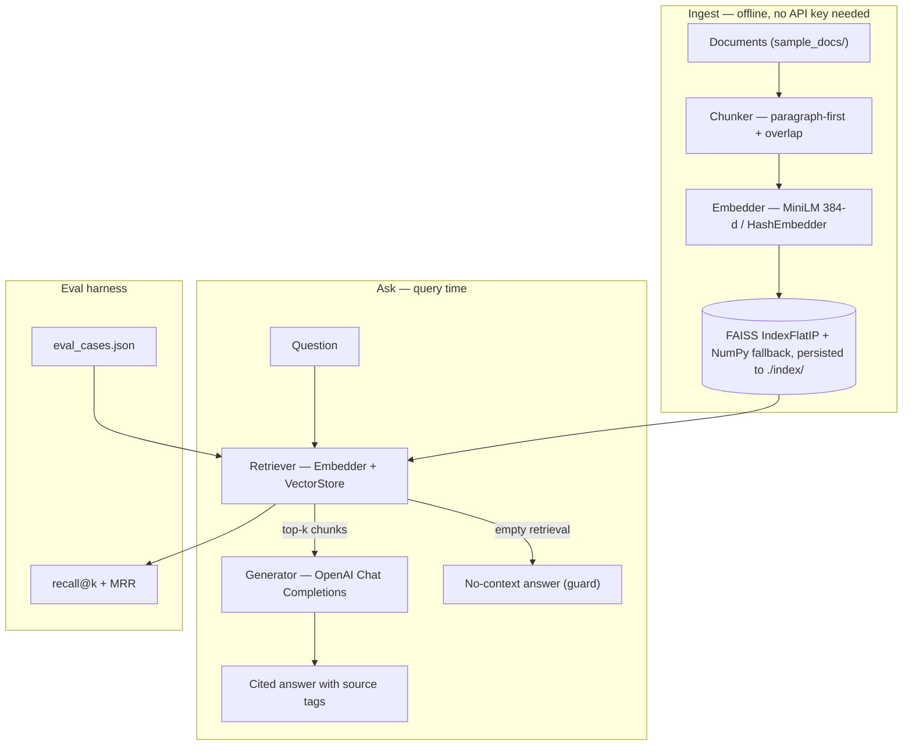

# RAG Assistant

## Overview

**RAG_Assistant** is a Retrieval-Augmented Generation system written in Python. It chunks documents, embeds them with sentence-transformers, indexes them in FAISS, retrieves relevant context for a user question, and generates a cited answer using the OpenAI Chat Completions API. It ships with a CLI, a Flask serving layer, a retrieval-quality evaluation harness, and a self-contained smoke pipeline so reviewers can verify the whole flow without an OpenAI key.

## Key Features

- **Chunker**: Paragraph-first splitting with a sentence-level fallback for very long paragraphs, plus configurable character-based overlap so answers aren't split across chunk boundaries.
- **Pluggable Embedder**: `Embedder` protocol with two implementations. `SentenceTransformerEmbedder` is the default (MiniLM 384-d); `HashEmbedder` is deterministic, zero-dep, and what the tests use so CI never has to download model weights.
- **FAISS Vector Store with NumPy Fallback**: `IndexFlatIP` over L2-normalized embeddings; falls back to NumPy cosine search if FAISS is unavailable.
- **Cited Answers, Refuses on Empty Retrieval**: The generator instructs the model to cite sources in `[source: ...]` brackets and returns a clear "no context" response when retrieval is empty — fixing the single most common RAG failure mode.
- **Retrieval Eval Harness**: `eval_retrieval(retriever, cases, k=)` reports **recall@k** and **MRR (mean reciprocal rank)** with per-case breakdowns.
- **CLI + Flask API + Docker**: `cli.py {ingest,ask,serve,eval}`; `app.py` exposes `/ask` and `/health`; `Dockerfile` builds a serve-able image.
- **Smoke Pipeline**: `python -m smoke.run_smoke` ingests three included sample docs, runs the eval cases, and writes `reports/smoke_eval.md` — no OpenAI key needed.

## Architecture

Standard Python package layout. Each pipeline stage is a separate class behind an interface, so swapping out the vector store (Chroma, Pinecone), embedder (OpenAI embeddings, Cohere), or generator (Anthropic, local Llama) is a one-class change.



```
rag/
  chunker.py            Paragraph-first chunker with sentence fallback
  embedder.py           Embedder protocol + SentenceTransformer + HashEmbedder
  vector_store.py       FAISS IndexFlatIP + NumPy fallback + JSON sidecar
  retriever.py          Embedder + VectorStore wrapper
  generator.py          OpenAI client with cited-answer prompt + empty-retrieval guard
  eval.py               recall@k + MRR
  pipeline.py           RAGPipeline.from_env() + ingest() + ask() + save()/load()
cli.py                  ingest / ask / serve / eval subcommands
app.py                  Flask /ask + /health
Dockerfile              python:3.11-slim with index/ baked in
sample_docs/            3 sample .md docs + eval_cases.json
smoke/run_smoke.py      End-to-end pipeline + reports/smoke_eval.md
tests/                  3 test files, no network required
requirements.txt
.env.example
```

## Example Usage

The pipeline runs in four stages:

- **Ingest**: Documents are loaded, chunked, embedded, and stored in a FAISS index that's persisted to disk under `./index/`.
- **Retrieve**: A user question is embedded and matched against the index; the top-k chunks are returned with cosine-similarity scores.
- **Generate**: The retrieved chunks are inserted into a system-prompted Chat Completions call; the model produces an answer citing the source of each claim.
- **Evaluate**: A JSON file of `{question, relevant_sources}` cases is replayed against the retriever; recall@k and MRR are reported per case and in aggregate.

## Getting Started

### Prerequisites

- **Python 3.10+**.
- **OpenAI API Key** (for the generation step only — retrieval works locally).

### Installation

Clone the repository and navigate to the project directory:

```bash
git clone https://github.com/lmdixon23/my_dev_projects.git
cd my_dev_projects/ai_engineering/rag_assistant
pip install -r requirements.txt
cp .env.example .env
# Edit .env and set OPENAI_API_KEY.
```

### Running

```bash
# Index the included sample docs
python cli.py ingest --docs-dir ./sample_docs --store ./index

# Ask a question
python cli.py ask --store ./index --question "What is RAG?"

# Serve over HTTP
python cli.py serve --store ./index --port 8080
curl -X POST http://localhost:8080/ask \
     -H "Content-Type: application/json" \
     -d '{"question": "What is RAG?"}'

# Container
docker build -t rag-assistant .
docker run -p 8080:8080 -e OPENAI_API_KEY=$OPENAI_API_KEY rag-assistant

# Smoke pipeline (no OpenAI key required)
python -m smoke.run_smoke
```

### Testing

```bash
python -m pytest tests/      # no network, no API key
```

## Technical Specifications

- **Language**: Python 3.10+
- **Embeddings**: `sentence-transformers/all-MiniLM-L6-v2` (384-d), pluggable
- **Vector Store**: FAISS `IndexFlatIP` over L2-normalized vectors, NumPy fallback
- **Generator**: OpenAI Chat Completions (`gpt-4o-mini` default), pluggable
- **Eval**: `recall@k`, MRR with per-case JSON output
- **Serving**: Flask (`/ask`, `/health`), Dockerfile checked in
- **Test Coverage**: 11 tests across 3 files; HTTP path mocked via `httpx.MockTransport`; embedder defaults to `HashEmbedder` in tests so no model download is required

## Results

Retrieval quality on the checked-in eval set (`sample_docs/eval_cases.json`, k=3), produced by `python -m smoke.run_smoke` (no API key required; full per-case breakdown written to `reports/smoke_eval.md`).

| Embedder | recall@3 | MRR | Cases |
|---|---|---|---|
| `all-MiniLM-L6-v2` (sentence-transformers) | 1.000 | 0.900 | 5 |
| `HashEmbedder` (no-deps fallback) | _run `smoke.run_smoke` without sentence-transformers installed to populate_ | | 5 |

This is a 5-case smoke eval (`sample_docs/eval_cases.json`), not a large benchmark — it verifies the retrieval path end-to-end and gives a reproducible number, not a leaderboard score. MRR 0.900 reflects one of the five questions ranking its relevant chunk 2nd instead of 1st. Regenerate with `python -m smoke.run_smoke`; the full per-case table is written to `reports/smoke_eval.md`.

## What This Project Demonstrates

- A RAG architecture built around **pluggable components** behind small interfaces. Replacing the vector store or embedder is one class, not a rewrite.
- **Network-free unit tests** for both the retrieval path (`HashEmbedder`) and the generation path (`httpx.MockTransport`).
- **Empty-retrieval guard** in the generator — the single most important defense against RAG hallucination, and the one most homemade implementations miss.
- **Honest evaluation**: ships an actual `recall@k` + MRR eval harness with checked-in cases, instead of just claiming "high quality".
- **Reproducible smoke pipeline**: `python -m smoke.run_smoke` exercises ingest + retrieve + eval end-to-end, no key required, and writes a markdown report a reviewer can read in 30 seconds.

## Optional Cross-Encoder Re-ranking

Embedding retrieval remains the default. Add `--rerank` to `ask` or `eval` to
retrieve a larger candidate pool and re-score it with
`cross-encoder/ms-marco-MiniLM-L-6-v2`:

```bash
python cli.py ask \
  --store ./index \
  --question "What is RAG?" \
  --rerank \
  --candidate-k 20 \
  -k 5

python cli.py eval \
  --store ./index \
  --cases ./sample_docs/eval_cases.json \
  --rerank \
  --candidate-k 20 \
  -k 3
```

For the Flask service, set `RERANKER_MODEL` and optionally
`RERANKER_CANDIDATES`. The JSON response exposes both the final cross-encoder
`score` and the original `retrieval_score`.

Run the baseline comparison with:

```bash
python -m smoke.run_reranker_eval
```

The generated `reports/reranker_eval.md` records baseline and re-ranked
recall@k and MRR, their deltas, and per-case reciprocal-rank changes. The
current five-case suite is saturated, so the observed delta is provisional
until the expanded benchmark in issue #18 is available.

### Measured Smoke Result

A CPU run using `sentence-transformers/all-MiniLM-L6-v2` and
`cross-encoder/ms-marco-MiniLM-L-6-v2` produced:

| Configuration | recall@3 | MRR |
|---|---:|---:|
| Embedding only | 1.000 | 0.900 |
| Cross-encoder re-ranked | 1.000 | 1.000 |
| Observed delta | +0.000 | +0.100 |

The re-ranker moved the approximate-nearest-neighbor question from rank 2 to
rank 1. This records the observed result on the checked-in five-case smoke
suite; it does not establish a general quality lift. Issue #18 remains the
required follow-up for a discriminative benchmark.

## Scope

- The chunker is character-based and language-agnostic, which is good portability but slightly worse than tokenization-aware chunking for very long contexts.
- No re-ranking layer (cross-encoder / cohere-rerank). Adding one is roughly a hundred lines and would typically lift MRR by 0.05–0.10.
- The generator uses single-shot completions; no streaming endpoint is exposed.
- "Multilingual" is supported by swapping the embedder model name (`paraphrase-multilingual-MiniLM-L12-v2`) but is not the default.

## Future Enhancements

Priority order: grow the eval set so the metrics discriminate, then layer quality and infra levers.

1. **Larger eval set**: The 5-case smoke set is saturated (MiniLM already scores recall@3 1.000 / MRR 0.900 — see Results), so it can no longer discriminate between retrieval approaches. Expand to 30–50 labeled cases so the metrics become a meaningful baseline to beat.
2. **Re-ranker**: Add a cross-encoder (`cross-encoder/ms-marco-MiniLM-L-6-v2`) over the top candidates before generation, and report the MRR delta on the (expanded) eval set (Scope flags the missing re-ranker; measure the lift rather than assert it).
3. **Token-aware chunking ablation**: Compare the current character-based chunker against a tokenizer-aware splitter on the eval set, turning the Scope chunking caveat into a measurement.
4. **Hybrid Search**: Add BM25 as a secondary retriever, merge with reciprocal rank fusion, and report before/after.
5. **Streaming Responses**: Switch the Flask `/ask` to a Server-Sent Events stream so the UI can render the answer as it arrives.
6. **Multi-tenant Index**: Support multiple namespaces in one store for SaaS use cases. (Lowest priority — infra, not retrieval quality.)

## References

- Lewis, P., et al. (2020). *Retrieval-Augmented Generation for Knowledge-Intensive NLP Tasks.* arXiv:2005.11401.
- Karpukhin, V., et al. (2020). *Dense Passage Retrieval for Open-Domain Question Answering.* arXiv:2004.04906.
- Johnson, J., Douze, M., & Jégou, H. (2017). *Billion-scale similarity search with GPUs.* arXiv:1702.08734. (FAISS)
- Reimers, N., & Gurevych, I. (2019). *Sentence-BERT: Sentence Embeddings using Siamese BERT-Networks.* arXiv:1908.10084.

Licensed under the [MIT License](https://github.com/lmdixon23/my_dev_projects/blob/main/LICENSE).
