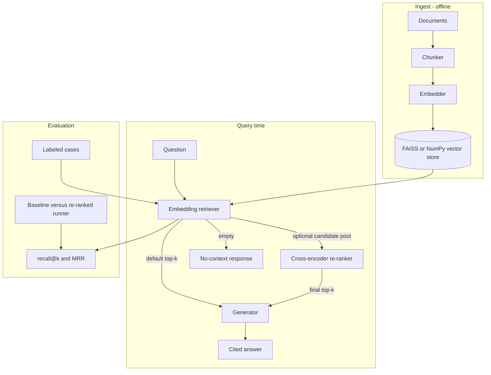

# RAG Assistant

## Overview

RAG Assistant is a modular Retrieval-Augmented Generation system written in Python. It chunks documents, embeds them, stores normalized vectors in FAISS or a NumPy fallback, retrieves relevant context, optionally re-ranks a larger candidate pool with a cross-encoder, and generates cited answers through the OpenAI Chat Completions API.

The repository includes a CLI, a Flask service, retrieval metrics, deterministic network-free tests, a basic smoke pipeline, and a baseline-versus-re-ranked comparison command.

## Verified Snapshot

A CPU run completed on 2026-07-26 with `sentence-transformers` 5.6.1, `transformers` 5.14.1, and `torch` 2.13.0:

| Configuration | recall@3 | MRR |
|---|---:|---:|
| Embedding retrieval | 1.000 | 0.900 |
| Cross-encoder re-ranked | 1.000 | 1.000 |
| Observed delta | +0.000 | +0.100 |

The re-ranker moved one relevant result from rank 2 to rank 1. This is a five-case smoke measurement over three small documents. It demonstrates that the comparison path works; it does not establish a general retrieval-quality lift. [Issue 18](https://github.com/lmdixon23/my_dev_projects/issues/18) tracks the required 30-50 case discriminative benchmark.

## Key Features

- **Paragraph-first chunking**: Long paragraphs fall back to sentence-level splitting, with configurable character overlap.
- **Pluggable embeddings**: `SentenceTransformerEmbedder` is the default; `HashEmbedder` provides deterministic, network-free tests.
- **FAISS with NumPy fallback**: Normalized vectors use inner-product search, equivalent to cosine similarity after normalization.
- **Optional cross-encoder re-ranking**: Embedding retrieval remains the default. An opt-in cross-encoder re-scores a configurable candidate pool before the final top-k is returned.
- **Score provenance**: Re-ranked responses expose both the final cross-encoder `score` and the original embedding `retrieval_score`.
- **Cited generation with an empty-context guard**: The generator requests source tags and refuses to produce a grounded answer when retrieval returns no context.
- **Retrieval evaluation**: `eval_retrieval` reports recall@k, MRR, and per-case results.
- **CLI, Flask, and Docker surfaces**: Ingestion, asking, evaluation, serving, and container execution use the same pipeline components.
- **Reproducible comparison**: `python -m smoke.run_reranker_eval` records aggregate and per-case changes between embedding-only and re-ranked retrieval.
- **Network-free validation**: The RAG suite contains 19 tests across 4 files. A separate two-test bridge verifies compatibility with the sibling LLM Eval Harness.

## Architecture



## File Map

```text
rag/
  chunker.py             Document and chunk types; paragraph-first splitting
  embedder.py            Embedder protocol, HashEmbedder, SentenceTransformerEmbedder
  vector_store.py        FAISS IndexFlatIP with NumPy fallback and persistence
  retriever.py           Embedding retrieval and optional candidate-pool expansion
  reranker.py            Reranker protocol and CrossEncoderReranker
  generator.py           OpenAI generation, source formatting, empty-context guard
  eval.py                EvalCase, recall@k, MRR, and per-case results
  pipeline.py            End-to-end ingest, retrieve, optional re-rank, and generate
cli.py                    ingest, ask, serve, and eval commands
app.py                    Flask /ask and /health endpoints
sample_docs/              Three sample documents and five labeled cases
smoke/run_smoke.py        Embedding-only end-to-end smoke evaluation
smoke/run_reranker_eval.py Baseline-versus-re-ranked CPU comparison
reports/                  Generated local reports; values may vary by environment
tests/
  test_chunker.py
  test_generator.py
  test_pipeline.py
  test_reranker.py
Dockerfile
requirements.txt
.env.example
```

## Getting Started

### Prerequisites

- Python 3.10+
- An OpenAI API key only for answer generation
- Downloadable sentence-transformers model weights for the default embedder and real cross-encoder comparison

### Installation

```bash
git clone https://github.com/lmdixon23/my_dev_projects.git
cd my_dev_projects/ai_engineering/rag_assistant
python -m venv .venv
# Windows PowerShell: .\.venv\Scripts\Activate.ps1
# macOS or Linux: source .venv/bin/activate
python -m pip install -r requirements.txt
cp .env.example .env
```

Set `OPENAI_API_KEY` in `.env` only when generation is required.

### Ingest and Ask

```bash
python cli.py ingest --docs-dir ./sample_docs --store ./index

# Embedding-only retrieval
python cli.py ask --store ./index --question "What is RAG?" -k 5

# Optional cross-encoder re-ranking
python cli.py ask \
  --store ./index \
  --question "What is RAG?" \
  --rerank \
  --candidate-k 20 \
  -k 5
```

### Evaluate Retrieval

```bash
# Embedding-only evaluation
python cli.py eval \
  --store ./index \
  --cases ./sample_docs/eval_cases.json \
  -k 3

# Re-ranked evaluation
python cli.py eval \
  --store ./index \
  --cases ./sample_docs/eval_cases.json \
  --rerank \
  --candidate-k 20 \
  -k 3

# Reproducible baseline comparison
python -m smoke.run_reranker_eval
```

The comparison writes `reports/reranker_eval.md` with aggregate metrics, deltas, and per-case reciprocal-rank changes.

### Serve over HTTP

Embedding-only retrieval remains the service default:

```bash
python cli.py serve --store ./index --port 8080
```

To enable service-side re-ranking, set:

```text
RERANKER_MODEL=cross-encoder/ms-marco-MiniLM-L-6-v2
RERANKER_CANDIDATES=20
```

Then send a request:

```bash
curl -X POST http://localhost:8080/ask \
  -H "Content-Type: application/json" \
  -d '{"question": "What is RAG?"}'
```

## Testing

```bash
python -m pytest tests/ -v
```

The current RAG suite contains **19 tests across 4 files**. The tests use deterministic embeddings, an injected fake cross-encoder, and `httpx.MockTransport`, so they require no model download, network call, or API key.

The cross-project bridge is run from the sibling harness:

```bash
cd ../llm_eval_harness
PYTHONPATH="$PYTHONPATH:$(realpath ../rag_assistant)" \
  python -m pytest tests/test_bridge_to_rag.py -v
```

The bridge contains **2 tests** and checks both a successful grading contract and a detected mismatch.

## Result Interpretation

The five-case result is useful for release verification because it confirms that:

1. the baseline and re-ranked paths execute against the same corpus and labels;
2. the candidate-pool and score-provenance logic are wired correctly;
3. aggregate and per-case deltas are reported reproducibly.

It is not large or difficult enough to support a broad comparative claim. The next evidence gate is [issue 18](https://github.com/lmdixon23/my_dev_projects/issues/18), which requires confusable sources, hard negatives, category slices, recall@1, recall@3, MRR, deterministic and real-model baselines, and regression checks.

## Scope and Limitations

- The checked-in benchmark has five cases over three small documents and is intentionally described as a smoke evaluation.
- The chunker is character-based rather than token-aware.
- Cross-encoder re-ranking is optional and requires external model weights for a real-model run; CI tests the control flow with an injected deterministic model.
- Retrieval is dense-only. BM25, hybrid retrieval, and reciprocal-rank fusion are not implemented.
- Generation is single-shot; the Flask service does not expose streaming responses.
- The default embedding model is English-oriented. Multilingual retrieval has not been benchmarked in this repository.
- The project is a compact reference system, not a multi-tenant production service.

## Future Enhancements

1. **Complete issue 18**: Build the 30-50 case discriminative benchmark before changing retrieval algorithms.
2. **Token-aware chunking ablation**: Compare the current splitter against a tokenizer-aware alternative on the expanded benchmark.
3. **Hybrid retrieval**: Add BM25 and reciprocal-rank fusion only after the benchmark can measure gains and regressions.
4. **Streaming responses**: Add a Server-Sent Events path for generation.
5. **Namespace isolation**: Add explicit index namespaces after retrieval quality and evaluation coverage are stable.

## References

- Lewis, P., et al. (2020). *Retrieval-Augmented Generation for Knowledge-Intensive NLP Tasks.* arXiv:2005.11401.
- Karpukhin, V., et al. (2020). *Dense Passage Retrieval for Open-Domain Question Answering.* arXiv:2004.04906.
- Johnson, J., Douze, M., and Jegou, H. (2017). *Billion-scale similarity search with GPUs.* arXiv:1702.08734.
- Reimers, N., and Gurevych, I. (2019). *Sentence-BERT.* arXiv:1908.10084.

Licensed under the [MIT License](../../LICENSE).
