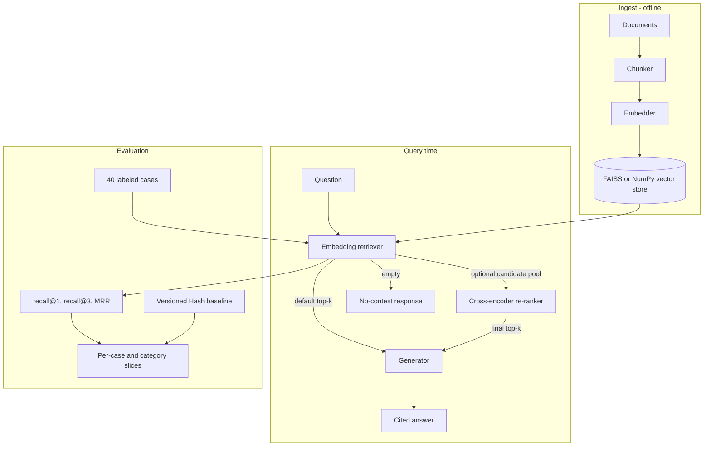

# RAG Assistant

## Overview

RAG Assistant is a modular Retrieval-Augmented Generation system written in Python. It chunks documents, embeds them, stores normalized vectors in FAISS or a NumPy fallback, retrieves relevant context, optionally re-ranks a larger candidate pool with a cross-encoder, and generates cited answers through the OpenAI Chat Completions API.

The repository includes a CLI, Flask service, versioned retrieval benchmark, deterministic regression baseline, network-free tests, smoke report, and baseline-versus-re-ranked comparison command.

## Verified Retrieval Benchmark

The checked-in `rag-retrieval-v1` benchmark contains **40 labeled cases over 10 documents and 31 chunks**. It includes eight cases in each required category:

- direct lookup;
- paraphrase;
- terminology and acronym variation;
- cross-chunk wording;
- hard negatives with plausible distractors.

The deterministic HashEmbedder baseline uses 512 dimensions with 400-character chunks and 80-character overlap:

| Metric | Baseline |
|---|---:|
| recall@1 | 0.500 |
| recall@3 | 0.775 |
| MRR | 0.629 |

| Category | Cases | recall@1 | recall@3 | MRR |
|---|---:|---:|---:|---:|
| Direct lookup | 8 | 0.250 | 0.750 | 0.479 |
| Paraphrase | 8 | 0.625 | 0.750 | 0.688 |
| Terminology | 8 | 0.500 | 0.875 | 0.688 |
| Cross-chunk | 8 | 0.750 | 0.750 | 0.750 |
| Hard negative | 8 | 0.375 | 0.750 | 0.542 |

This is a project regression baseline, not a leaderboard or production-quality retrieval claim. HashEmbedder is intentionally weak and deterministic. Its purpose is to make CI sensitive to changes in corpus loading, chunking, labels, metric aggregation, and ranking behavior without downloading model weights.

The earlier five-case MiniLM comparison from 2026-07-26 produced recall@3 `1.000` for both configurations and MRR `0.900` versus `1.000` after re-ranking. That result is historical and not directly comparable with the expanded benchmark. Run the current MiniLM comparison before making a new re-ranking claim.

## Metric Definitions and Regression Rule

- **recall@1**: fraction of cases with an accepted source at rank 1.
- **recall@3**: fraction with an accepted source in the top three.
- **MRR**: mean reciprocal rank of the first accepted source; a miss contributes zero.
- **Multi-source label**: any listed relevant source can satisfy the case.
- **Category slice**: the same metrics aggregated only over cases carrying a given tag.

The checked-in regression thresholds allow a small bounded change while rejecting material losses:

- recall@1 must remain at least `0.450`;
- recall@3 must remain at least `0.725`;
- MRR must remain at least `0.579`;
- no required category may lose more than one of its eight top-three hits.

Comparisons are valid only when the corpus, labels, chunk settings, and embedder remain fixed. A changed benchmark version requires a new recorded baseline.

## Key Features

- **Paragraph-first chunking**: Long paragraphs fall back to sentence-level splitting, with configurable character overlap.
- **Pluggable embeddings**: `SentenceTransformerEmbedder` is the production-like default; `HashEmbedder` provides deterministic network-free evaluation.
- **FAISS with NumPy fallback**: Normalized vectors use inner-product search, equivalent to cosine similarity after normalization.
- **Optional cross-encoder re-ranking**: Embedding retrieval remains the default. An opt-in cross-encoder re-scores a configurable candidate pool.
- **Score provenance**: Re-ranked responses expose the final cross-encoder score and original embedding retrieval score.
- **Cited generation with an empty-context guard**: The generator requests source tags and refuses a grounded answer when retrieval returns no context.
- **Versioned evaluation schema**: Stable case IDs and tags extend the legacy `question` and `relevant_sources` fields.
- **Dataset validation**: Tests enforce unique IDs, non-empty labels, existing sources, and required category coverage.
- **Retrieval metrics**: `eval_retrieval` reports recall@1, recall@3, configurable recall@k, MRR, per-case ranks, and tag slices.
- **Reproducible comparison**: `python -m smoke.run_reranker_eval` compares embedding-only and re-ranked retrieval on the same benchmark.
- **Network-free validation**: The RAG suite contains 34 tests across 6 files. A separate two-test bridge verifies compatibility with the sibling LLM Eval Harness.

## Architecture



## File Map

```text
rag/
  chunker.py               Document and chunk types; paragraph-first splitting
  embedder.py              HashEmbedder and SentenceTransformerEmbedder
  vector_store.py          FAISS IndexFlatIP with NumPy fallback and persistence
  retriever.py             Embedding retrieval and optional candidate expansion
  reranker.py              Reranker protocol and CrossEncoderReranker
  generator.py             OpenAI generation, source formatting, empty-context guard
  eval.py                  Case loading, validation, ranking metrics, and slices
  pipeline.py              End-to-end ingest, retrieve, optional re-rank, generate
cli.py                      ingest, ask, serve, and eval commands
sample_docs/
  *.md                      Ten overlapping and confusable benchmark documents
  eval_cases.json           Forty stable-ID cases with source labels and tags
  hash_baseline_v1.json     Deterministic baseline and regression thresholds
smoke/run_smoke.py          Hash baseline by default; optional local MiniLM run
smoke/run_reranker_eval.py  MiniLM baseline-versus-re-ranked comparison
reports/                    Generated local reports
tests/
  test_chunker.py
  test_generator.py
  test_pipeline.py
  test_reranker.py
  test_eval.py
  test_benchmark.py
Dockerfile
requirements.txt
.env.example
```

## Getting Started

### Prerequisites

- Python 3.10+
- An OpenAI API key only for answer generation
- Downloadable sentence-transformers weights only for MiniLM or real cross-encoder runs

### Installation

```bash
git clone https://github.com/lmdixon23/my_dev_projects.git
cd my_dev_projects/ai_engineering/rag_assistant
python -m venv .venv
# Windows PowerShell: .\.venv\Scripts\Activate.ps1
# macOS or Linux: source .venv/bin/activate
python -m pip install -r requirements.txt
cp .env.example .env
```

Set `OPENAI_API_KEY` in `.env` only when generation is required.

### Ingest and Ask

```bash
python cli.py ingest --docs-dir ./sample_docs --store ./index

# Embedding-only retrieval
python cli.py ask --store ./index --question "What is RAG?" -k 5

# Optional cross-encoder re-ranking
python cli.py ask \
  --store ./index \
  --question "What is RAG?" \
  --rerank \
  --candidate-k 20 \
  -k 5
```

### Run the Deterministic Benchmark

```bash
python -m smoke.run_smoke
```

The default command uses `HashEmbedder`, writes `reports/smoke_eval.md`, and reproduces the checked-in regression baseline without network access.

Run a local MiniLM benchmark against the same corpus and labels:

```bash
RAG_EVAL_EMBEDDER=minilm python -m smoke.run_smoke
```

Windows PowerShell:

```powershell
$env:RAG_EVAL_EMBEDDER = "minilm"
python -m smoke.run_smoke
Remove-Item Env:RAG_EVAL_EMBEDDER
```

### Evaluate a Saved Store

```bash
python cli.py eval \
  --store ./index \
  --cases ./sample_docs/eval_cases.json \
  -k 3
```

The CLI prints aggregate metrics, per-case first relevant ranks, and all tag slices. Legacy case files containing only `question` and `relevant_sources` still load, although the versioned benchmark requires IDs and tags.

### Compare the Re-ranker

```bash
python -m smoke.run_reranker_eval
```

This local-model command writes `reports/reranker_eval.md` with recall@1, recall@3, MRR, required category slices, and per-case rank changes. It requires sentence-transformers model weights and does not require an OpenAI API key.

### Serve over HTTP

Embedding-only retrieval remains the service default:

```bash
python cli.py serve --store ./index --port 8080
```

To enable service-side re-ranking, set:

```text
RERANKER_MODEL=cross-encoder/ms-marco-MiniLM-L-6-v2
RERANKER_CANDIDATES=20
```

Then send a request:

```bash
curl -X POST http://localhost:8080/ask \
  -H "Content-Type: application/json" \
  -d '{"question": "What is RAG?"}'
```

## Testing

```bash
python -m pytest tests/ -v
```

The RAG suite contains **34 tests across 6 files**. It covers chunking, generation, pipeline persistence, re-ranking, metric aggregation, multi-source labels, missing hits, category slices, benchmark validation, and deterministic regression thresholds. Tests use deterministic embeddings, an injected fake cross-encoder, and `httpx.MockTransport`, so they require no model download, network call, or API key.

The cross-project bridge is run from the sibling harness:

```bash
cd ../llm_eval_harness
PYTHONPATH="$PYTHONPATH:$(realpath ../rag_assistant)" \
  python -m pytest tests/test_bridge_to_rag.py -v
```

The bridge contains **2 tests** and checks both a successful grading contract and a detected mismatch.

## Result Interpretation

The expanded benchmark is designed to compare retrieval changes on a fixed project corpus. It is materially more discriminative than the previous five-case smoke suite because it includes confusable documents, hard negatives, multiple acceptable sources, stable case IDs, and category slices.

The deterministic HashEmbedder score should not be read as model quality. It establishes that the benchmark and metric path are reproducible in CI. MiniLM, re-ranking, token-aware chunking, or hybrid retrieval should be evaluated on the same benchmark and reported as a before-and-after comparison.

## Scope and Limitations

- The benchmark is a small synthetic technical corpus, not a public retrieval leaderboard.
- HashEmbedder is a deterministic test instrument rather than a semantic model.
- The chunker is character-based rather than token-aware.
- Cross-encoder re-ranking is optional and requires external model weights for a real-model run.
- Retrieval is dense-only. BM25, hybrid retrieval, and reciprocal-rank fusion are documented benchmark topics, not implemented production features.
- Generation is single-shot; the Flask service does not expose streaming responses.
- The default embedding model is English-oriented. Multilingual retrieval is represented conceptually but not evaluated with a multilingual corpus.
- The project is a compact reference system, not a multi-tenant production service.

## Future Enhancements

1. **Token-aware chunking ablation**: Compare the current splitter with a tokenizer-aware alternative on `rag-retrieval-v1`.
2. **Expanded MiniLM and re-ranker run**: Record real-model aggregate and category results on the new benchmark.
3. **Hybrid retrieval**: Add BM25 and reciprocal-rank fusion only as a separate measured change.
4. **Streaming responses**: Add a Server-Sent Events generation path.
5. **Namespace isolation**: Add explicit index namespaces and authorization tests.

## References

- Lewis, P., et al. (2020). *Retrieval-Augmented Generation for Knowledge-Intensive NLP Tasks.* arXiv:2005.11401.
- Karpukhin, V., et al. (2020). *Dense Passage Retrieval for Open-Domain Question Answering.* arXiv:2004.04906.
- Johnson, J., Douze, M., and Jegou, H. (2017). *Billion-scale similarity search with GPUs.* arXiv:1702.08734.
- Reimers, N., and Gurevych, I. (2019). *Sentence-BERT.* arXiv:1908.10084.

Licensed under the [MIT License](../../LICENSE).
